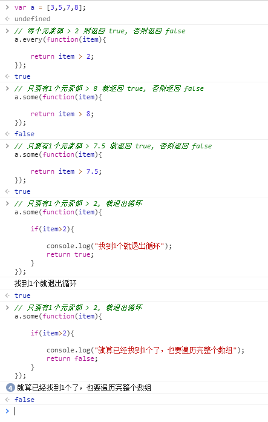

# JavaScript 重要的高级函数


## 目录
1. 字符串
- [split()](#split)
- [join()](#join)

2. 数组
- 排序函数
	- [sort()](#sort)

- 循环函数
	- [values](#values)
	- [reduce(), map()](#reduce)
	- [forEach()](#forEach)
	- [every(), some()](#every)

- 查找
	- [indexOf(), lastIndexOf()](#indexOf)

3. 对象


## 正文
1. 字符串
- <span id="split">split()</span>
```javascript
var a = "hello world in the computer";
a.split(' '); // 输出 ["hello", "world", "in", "the", "computer"]

var a = "helloworld";
a.split(''); // 输出 ["h", "e", "l", "l", "o", "w", "o", "r", "l", "d"]
```

- <span id="join">join()</span>
```javascript
var a = ["h", "e", "l", "l", "o", "w", "o", "r", "l", "d"];
a.join(''); // 输出 helloworld
```

2. 数组
- 排序函数
	- <span id="sort">sort()</span>
		- 字符串排序
		
		```javascript
		var arr = ['b','a','r','z','m'];
		arr.sort(function(a,b){

			// 升序
			if(a<b){ return -1; }
			else if(a>b){ return 1; }
			else{ return 0; }

			// 降序 return 1; return -1; return 0;
		});
		```

		- 数字排序
		
		```javascript
		var arr = [12, 23, 54, 10, 7];
		arr.sort(function(a,b){

			return a-b; // 升序

			// return b-a; // 降序
		});
		```

- 循环函数

	- <span id="values">values()</span>
	```javascript
	var arr = [1,2,3,4,5];
	var arrIterator = arr.values();

	for (const value of arrIterator) {

	  console.log(value);
	}
	```

	- <span id="reduce">reduce(), map()</span>
	
	```javascript
	var arr = [1,2,3,4,5];
	arr = arr.map(function(item, index, arr){

		return item+1;
	}); // [2,3,4,5,6]
	```

	

	- <span id="forEach">forEach()</span>
	
	

	```javascript
	var array1 = ['a', 'b', 'c'];

	array1.forEach(function(element) {
	  console.log(element);
	});
	```


	- <span id="every">every(), some()</span>

	

- 查找
	- <span id="indexOf">indexOf(), lastIndexOf()</span>

	```javascript
	var arr = [1,2,3,4,5];

	// 输出1
	arr.indexOf(2);
	arr.lastIndexOf(2);

	// 输出4
	arr.indexOf(5);
	arr.lastIndexOf(5);
	```

